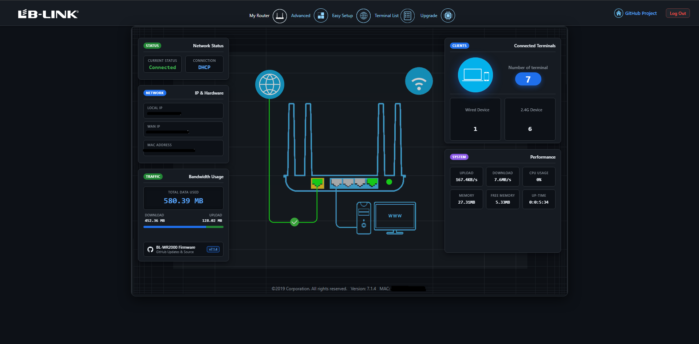

# LB-LINK BL-WR2000 Firmware Mod, DHCP DNS & Timezone Fix

Custom firmware tooling, DHCP DNS & Timezone synchronization bug fixes, and reverse-engineering suite for the **LB-LINK BL-WR2000 (V7.1.4)** router.

[](#hardware-specifications)
[-orange.svg)](#hardware-specifications)
[-green.svg)](#hardware-specifications)
[-brightgreen.svg)](#firmware-toolchain)
[](../../releases/tag/pre-release)

<p align="center">
  
</p>

---

## Project Overview

> [!WARNING]
> Flash at your own risk. This project is open source. Feel free to check the code before flashing.

This repository contains the reverse-engineering analysis, automated Python tooling, and rootfs patches for the **LB-LINK BL-WR2000** wireless router.

### Key Achievements:
* **Modified Dashboard to a Dark Theme**: Redesigned the stock legacy blue "My Router" dashboard into a sleek dark theme featuring real-time bandwidth usage metrics and single-band (2.4G) client telemetry.
* **Dedicated Health Check Diagnostic Dashboard**: Added a 6th navigation tab and dedicated real-time diagnostics dashboard (`health.html`) featuring a 4-step network and service audit pipeline, live CPU and RAM telemetry gauges, physical Ethernet port link matrix, and interactive ping testing.
* **Fixed the DHCP Custom DNS Bug**: Resolved the factory firmware defect where connected clients (Windows, macOS, Android, iOS) were permanently stuck receiving `192.168.16.1` and `8.8.8.8`, ignoring user-configured DNS servers.
* **Fixed Timezone & NTP Clock Synchronization**: Restored the hidden Time Zone configuration card (completing the 3x4 grid), enabled persistent `/sbin/ntp.sh` startup, added a dedicated `(GMT+08:00) Philippines, Manila` option, and verified second-accurate firewall/parental control scheduling.
* **Zero-Linux Cross-Platform Toolchain**: Created [`firmware_tool.py`](./firmware_tool.py) to decompile, patch, and repack firmware images directly on Windows without requiring Linux root/sudo, WSL, or custom kernel drivers.
* **100% Stock Fidelity & Device Node Preservation**: Preserves all 63 special character/block devices (`/dev/console`, `/dev/nvram`, `/dev/flash0`, etc.) and 109 symlinks via [`.manifest.json`](./rootfs/.manifest.json).
* **Automated 5-Layer Validator**: Developed [`verify_uimage.py`](./verify_uimage.py) to validate U-Boot headers, LZMA compression, MIPS instructions, XZ streams, and device nodes before flashing.
* **Verified Local Web Upgrade**: Tested and documented local web-based upgrades via `/cgi-bin/upload.cgi`, allowing subsequent firmware flashing directly from the browser without TFTP or physical button presses.
* **Automated Rolling CI/CD Pre-Release**: Configured a GitHub Actions workflow that automatically compiles and validates the latest `uImage` (TFTP) and `update_firmware.bin` (Web UI) on every commit to `main`, publishing them to a single continuous pre-release.
* **TFTP Safe Flashing & Recovery**: Full instructions and tested recovery images in [`backup/`](./backup/) for unbrickable flashing using `tftpd32.exe`.

---

## Hardware Specifications

| Component | Specification |
| :--- | :--- |
| **Model** | LB-LINK BL-WR2000 (28AE4) |
| **SoC** | MediaTek / Ralink MT7628NN |
| **CPU Architecture** | MIPS 24Kc (Little Endian - `mipsel`) @ 580 MHz |
| **Flash Memory** | 4 MB (SPI NOR Flash - ~3.84 MB partition for `uImage`) |
| **RootFS Storage (Uncompressed)** | ~10.14 MB (10,136,576 bytes total source file tree extracted into RAM) |
| **RootFS Storage (Compressed)** | ~2.24 MB XZ archive (kernel initramfs slot limit: 2.28 MB / 2,398,400 bytes) |
| **RAM** | 32 MB / 64 MB DDR2 (hosts runtime `ramfs` / `tmpfs` rootfs) |
| **Stock Kernel** | Linux 2.6.36 (Buildroot 2012.11.1) |
| **Stock Firmware** | `WRS-432-300M-28N-S-EN,7.1.4-20210113-upgrade` |
| **Web Server** | GoAhead WebServer with ASP & JSON API |
| **Default IP** | `192.168.16.1` |
| **Default Subnet** | `255.255.255.0` |

---

## The DHCP DNS Bug & Solution

### The Problem
In factory stock firmware V7.1.4, when a user configures Custom DNS in the Web Admin UI (e.g., Cloudflare `1.1.1.1` or Google `8.8.8.8`):
1. The UI saves the DNS addresses to NVRAM variables `wan_primary_dns` and `wan_secondary_dns`.
2. The DHCP server configuration script ([`rootfs/sbin/lan.sh`](./rootfs/sbin/lan.sh) and [`rootfs/sbin/url_dns.sh`](./rootfs/sbin/url_dns.sh)) only reads `dhcpPriDns` and `dhcpSecDns`, which default to `192.168.16.1` and `8.8.8.8`.
3. Neither `libshare` nor `config-dns.sh` ever synced the WAN DNS into DHCP or reloaded `udhcpd`.
4. Result: All connected devices remained stuck using `192.168.16.1` and `8.8.8.8`.

### The Solution
* **[`rootfs/sbin/config-dns.sh`](./rootfs/sbin/config-dns.sh)**: Updated to sync `$1` and `$2` directly into `dhcpPriDns`/`dhcpSecDns`, update `/etc/udhcpd.conf`, and reload `udhcpd` **without dropping physical Ethernet switch PHY links**.
* **[`rootfs/sbin/lan.sh`](./rootfs/sbin/lan.sh) & [`rootfs/sbin/url_dns.sh`](./rootfs/sbin/url_dns.sh)**: Checks `wan_dns_switch`. If custom DNS is enabled, it automatically overrides `dhcpPriDns` and `dhcpSecDns` with `wan_primary_dns` and `wan_secondary_dns`.
* **Hardware Verified**: Connected Windows PC immediately receives `1.1.1.1` and `1.0.0.1` via DHCP lease with zero network flapping.

See [DHCP_DNS_BUG_AND_FIX.md](./DHCP_DNS_BUG_AND_FIX.md) for full technical analysis and diffs.

---

## The Timezone & NTP Bug & Solution

### The Problem
In factory stock firmware V7.1.4:
1. The **Time Zone** configuration card was completely hidden from the Web UI grid, preventing users from setting their timezone.
2. Startup script ([`rootfs/etc_ro/rcS`](./rootfs/etc_ro/rcS)) never executed `/sbin/ntp.sh &` and never initialized `/etc/TZ`, leaving the system clock stuck at year 2011/1970 in UTC.
3. NTP was hardcoded to `time.pool.aliyun.com`, which frequently timed out outside China.
4. Scheduled Child Protection (parental control internet access cutoffs) and Wi-Fi sleep timers failed to function accurately or triggered at erratic hours.
5. There was no localized entry for the Philippines (`(GMT+08:00) Philippines, Manila` / `PHT_008`).

### The Solution
* **[`rootfs/etc_ro/rcS`](./rootfs/etc_ro/rcS)**: Automatically writes `echo "GMT-8" > /etc/TZ` and launches `/sbin/ntp.sh &` on system boot.
* **Factory Defaults ([`RT2860_default_vlan`](./rootfs/etc_ro/Wireless/RT2860AP/RT2860_default_vlan) & [`RT2860_default_novlan`](./rootfs/etc_ro/Wireless/RT2860AP/RT2860_default_novlan))**: Default timezone set to `TZ=PHT_008` with fallback NTP server `time.windows.com`.
* **Web UI Card Restored ([`rootfs/etc_ro/web/admin/more.html`](./rootfs/etc_ro/web/admin/more.html))**: Restored the 12th card (Time Zone) under **Advanced -> System**, completing the 3x4 grid.
* **Dedicated Philippines Option (`PHT_008`)**: Added a dedicated `(GMT+08:00) Philippines, Manila` option alongside existing regional timezones, with multi-language translations across English, Turkish, Spanish, German, Russian, and French.
* **Live System Time Display ([`rootfs/etc_ro/web/admin/terminal.html`](./rootfs/etc_ro/web/admin/terminal.html))**: Added real-time router clock feedback inside client bandwidth and time limit dialogs.
* **Hardware Verified**: Live testing confirmed internet access cuts off at the exact scheduled second for client devices.

See [TIMEZONE_NTP_BUG_AND_FIX.md](./TIMEZONE_NTP_BUG_AND_FIX.md) for full technical analysis, root causes, and overnight scheduling guide.

---

## Firmware Toolchain (`firmware_tool.py`)

[`firmware_tool.py`](./firmware_tool.py) is a standalone Python tool that handles the full decompilation and compilation lifecycle.

### Usage:

```bash
# 1. Extract and decompile uImage into rootfs/ directory:
python firmware_tool.py extract uImage

# 2. Build modified rootfs into bootable images:
#    Default: builds BOTH uImage (for TFTP) and update_firmware.bin (for Web UI)
python firmware_tool.py build

#    Or build a specific image only:
python firmware_tool.py build uImage               # Build uImage only
python firmware_tool.py build update_firmware.bin  # Build update_firmware.bin only

# 3. Verify built images before flashing:
python verify_uimage.py uImage
python verify_uimage.py update_firmware.bin

# 4. Repack untouched kernel baseline (for diagnostic testing):
python firmware_tool.py repack-kernel vmlinux_orig.bin uImage
```

### Changing Firmware Version for New Updates

The firmware version displayed throughout the router Web Admin UI is controlled by:
* [`rootfs/etc_ro/FW-Version`](./rootfs/etc_ro/FW-Version)

**File Syntax:**
```
<HARDWARE_MODEL_ID>,<VERSION_NUMBER>
```

**Example:**
```
WRS-432-300M-28N-S-EN,7.1.5
```

* **Model Prefix**: Keep `WRS-432-300M-28N-S-EN` intact. The router's web server inspects the board suffix (`-S-` for single-band 2.4 GHz vs `-D-` for dual-band) to toggle dual-band wireless menus.
* **Version String**: The text following the comma (e.g. `7.1.5`) is parsed by `/goform/get_router_info` and displayed on the Web Admin status page.
* **Line Endings**: Always maintain Unix LF (`\n`) line endings.

### Engineering Highlights inside `firmware_tool.py`:
1. **Device Node Manifest (`.manifest.json`)**: Preserves all 63 special character/block devices (`/dev/console` `c 5 1`, `/dev/nvram` `c 251 0`, `/dev/null` `c 1 3`, `/dev/flash0` `c 200 0`, etc.) when extracting to Windows NTFS.
2. **U-Boot Header Builder**: Creates headers matching Ralink U-Boot expectations (`OS=5` Linux, `Arch=5` MIPS, `Type=2` Kernel, `Comp=3` LZMA).
3. **Legacy LZMA1 Injection**: Injects the exact 13-byte header (`5d 00 00 00 02 7c 28 69 00 00 00 00 00`) specifying the exact uncompressed kernel size (`6,891,644` bytes) to prevent `LzmaDecode` RAM overflow.
4. **Adaptive XZ Compression**: Automatically selects optimal dictionary sizing to fit within the 2,398,400-byte kernel slot.
5. **MIPS Kernel Size Patcher**: Updates `populate_rootfs` opcodes (`lui $s3, high; addiu $s3, $s3, low`) to match the exact size of the newly built XZ initramfs, preventing kernel panics (`junk in compressed archive`).
6. **Automated CRLF Sanitizer**: Strips Windows carriage returns (`\r\n` -> `\n`) on all shell scripts and system configs so Windows Git never breaks Linux execution.

---

## Automated Verification (`verify_uimage.py`)

Run the 5-layer validator before flashing any built image:

```bash
python verify_uimage.py uImage
```

### Validator Layers:
* **Layer 1: U-Boot Header Audit**: Validates magic number (`0x27051956`), OS (`Linux`), Architecture (`MIPS`), Type, Compression, Load address (`0x80000000`), Entry point (`0x8000C150`), and both Header & Data CRC32 checksums.
* **Layer 2: Kernel Payload Decompression**: Tests raw LZMA1 decompression and validates uncompressed kernel size.
* **Layer 3: Kernel Initramfs Instructions**: Disassembles MIPS instructions at `0x426084` to verify `__initramfs_end` calculation.
* **Layer 4: Initramfs XZ Archive**: Decompresses the embedded XZ slice to confirm valid stream headers and CRC.
* **Layer 5: Filesystem & Device Nodes Audit**: Verifies CPIO records, file counts, symlinks, and confirms critical device nodes (`/dev/console`, `/dev/nvram`, `/dev/null`, `/dev/flash0`) have correct major/minor IDs.

---

## Flashing Guide

Flashing is performed using TFTP and the router's built-in U-Boot recovery mechanism:

1. Connect your computer via Ethernet cable directly to **LAN Port 1** on the router.
2. Configure the Ethernet network adapter connected to the router as:
   * **IP address:** `192.168.16.123`
   * **Subnet mask:** `255.255.255.0`
   * **Default gateway:** *(leave blank)*
   * Note: During TFTP recovery, the router temporarily uses IP `192.168.16.100` and downloads `uImage` from the host computer at `192.168.16.123`.
3. Launch `tftpd32.exe` (or `tftpd64.exe`), set **Current Directory** to this project root, and select `192.168.16.123` as the **Server interface**.
4. Power off the router.
5. Hold down the **WPS/RESET** button on the router and power it on. Keep holding for 5-8 seconds until the LAN LED flashes rapidly.
6. The router (at `192.168.16.100`) will automatically connect to your computer (`192.168.16.123`) via TFTP, download `uImage`, and flash it into SPI Flash memory.
7. Once flashing is complete, set the Ethernet network adapter back to DHCP ("Obtain an IP address automatically"). The router will boot into normal mode (`192.168.16.1`), assign an IP (`192.168.16.x`) to your computer, and the web admin interface will be reachable at `http://192.168.16.1`.

For troubleshooting and step-by-step images, see [FLASHING_GUIDE.md](./FLASHING_GUIDE.md).

---

## Upgrading Firmware via Web Admin UI (Local Upgrade)

Once the router is running any bootable firmware, subsequent updates can be installed directly through the Web Admin UI without TFTP or holding buttons:

1. Build the upgrade images:
   ```bash
   python firmware_tool.py build
   ```
2. Verify the image before uploading:
   ```bash
   python verify_uimage.py update_firmware.bin
   ```
3. Open your browser and log into the router at `http://192.168.16.1/login.asp`.
   > [!NOTE]
   > The router enforces a strict 300-second (5-minute) inactivity session timeout in GoAhead (`websSecurityHandler`). If an unauthenticated or expired session attempts to post or query `/goform/`, the router responds with `{"result":8}`. Always log in freshly before navigating to the firmware upgrade page.
4. Navigate to **More Function** $\rightarrow$ **Firmware Upgrade** (or directly open `http://192.168.16.1/admin/upload_firmware.html`).
5. Click the **Local Upgrade** tab on the top-left toggle bar (`#update_local`). By default, the page opens to "Online Update", which hides the local file upload form.
6. Click **Choose File** and select `update_firmware.bin`.
7. Click **Apply / Upgrade**. The browser will stream the binary to `/cgi-bin/upload.cgi`, write it to the `Kernel` MTD partition, and reboot automatically in 1 to 2 minutes.

---

## Cloudflare Worker HTTP OTA Updater

The factory stock OTA updater failed because:
1. The vendor server (`sandbox.b-link.net.cn`) is decommissioned and offline.
2. The router's embedded `wget` lacks SSL/TLS support and cannot directly download from HTTPS endpoints such as GitHub Releases.
3. GitHub Releases strictly enforce HTTPS and issue 302 redirects to Azure Blob Storage.

To resolve this, a lightweight Cloudflare Worker sits between the router and GitHub Releases. It serves plain HTTP to the router while fetching the release binary over HTTPS from GitHub, following all redirects.

* **Live Cloudflare Worker URL:** `https://bl-wr2000-ota-updater.romel-brosas.workers.dev`
* **Worker Project Folder:** [`scripts/cf-ota-updater/`](./scripts/cf-ota-updater/)
* **Publishing Guide:** See [`scripts/cf-ota-updater/README.md`](./scripts/cf-ota-updater/README.md) for Wrangler deployment instructions.

### Online Update via Web Admin UI

1. Open the router Web Admin at `http://192.168.16.1/admin/upload_firmware.html`.
2. Stay on the **Online Update** tab (`#update_online`).
3. The Server input defaults to `https://bl-wr2000-ota-updater.romel-brosas.workers.dev`.
4. Click **Check for Updates**. The browser queries `/api/version` on the Worker.
5. If an update is available, the release version, MD5 hash, and release notes will be displayed.
6. Click **Download and Flash Firmware**. The browser downloads the firmware directly, validates the U-Boot header magic bytes (`0x27051956`), uploads it to `/cgi-bin/upload.cgi`, and monitors the 70-second reboot process.

### Standalone CLI OTA Script (`/sbin/ota_upgrade.sh`)

For automated or remote updates over Telnet / SSH:

```bash
# Run with default live Worker URL:
/sbin/ota_upgrade.sh

# Or specify a custom Worker URL:
/sbin/ota_upgrade.sh http://bl-wr2000-ota-updater.romel-brosas.workers.dev
```

The script:
1. Downloads `upgrade.txt` via plain HTTP.
2. Compares the remote version against `/etc_ro/FW-Version`.
3. Downloads `update_firmware.bin` to `/tmp/update_firmware.bin`.
4. Computes and verifies MD5 checksum using BusyBox `md5sum`.
5. Executes `/bin/mtd_write -o 0 -l 0 write /tmp/update_firmware.bin Kernel` and triggers a system reboot.

---

## Repository Structure

```
.
|-- .github/workflows/
|   \-- build-release.yml           # Continuous CI/CD build and pre-release publisher
|-- .gitattributes                  # Enforces LF line endings across all platforms
|-- .gitignore                      # Python and temporary file ignore rules
|-- README.md                       # Main project documentation
|-- BOOT_TROUBLESHOOTING_POSTMORTEM.md # Detailed postmortem of all boot pitfalls & fixes
|-- DHCP_DNS_BUG_AND_FIX.md         # In-depth analysis of the DHCP DNS bug and solution
|-- FLASHING_GUIDE.md               # Step-by-step TFTP upgrade and recovery guide
|-- FIRMWARE_REVERSING_GUIDE.md     # Reverse-engineering notes & memory layout
|-- firmware_tool.py                # Standalone decompiler, compiler & repacker tool
|-- verify_uimage.py                # 5-layer firmware validation script
|-- uImage                          # Ready-to-flash modified firmware image (TFTP)
|-- update_firmware.bin             # Ready-to-upload firmware binary (Web Admin UI)
|-- backup/                         # Stock firmware backups for recovery
|   |-- uImage_stock                # Factory stock uImage binary
|   \-- WRS-432-300M-...-upgrade   # Original vendor upgrade file
|-- scripts/
|   \-- cf-ota-updater/             # Cloudflare Worker HTTP OTA proxy & server
|       |-- package.json            # Node.js dependencies (Wrangler)
|       |-- wrangler.toml           # Worker config, route, and environment variables
|       |-- README.md               # Step-by-step Wrangler publish guide
|       \-- src/index.js            # Worker routing & GitHub release proxy logic
\-- rootfs/                         # Decompiled Linux root filesystem
    |-- .manifest.json              # Device nodes and permissions metadata
    |-- bin/                        # Busybox and system binaries
    |-- dev/                        # Placeholders for 63 device nodes
    |-- etc/                        # System configurations
    |-- etc_ro/                     # Read-only vendor configurations & Web UI
    |   |-- FW-Version              # Model identification and firmware version string
    |   |-- web/                    # GoAhead web pages, JS, CSS, and images
    |   \-- Wireless/               # Ralink/MediaTek default NVRAM configs
    |-- lib/                        # Shared C libraries (uClibc, libshare, etc.)
    \-- sbin/                       # Network management shell scripts
        |-- config-dns.sh           # Custom DNS propagation fix
        |-- lan.sh                  # LAN & DHCP management
        \-- ota_upgrade.sh          # Standalone HTTP OTA upgrade script
```

---

## Technical Documentation Links

* [Boot Troubleshooting Postmortem](./BOOT_TROUBLESHOOTING_POSTMORTEM.md): Complete technical explanation of U-Boot OS bytes, Windows CRLF bugs, device node manifests, and LZMA size headers.
* [DHCP DNS Bug Analysis](./DHCP_DNS_BUG_AND_FIX.md): Root cause investigation and code diffs for custom DNS propagation.
* [TFTP Flashing Tutorial](./FLASHING_GUIDE.md): Instructions for firmware upgrades, recovery, and IP configuration.
* [Firmware Reversing Guide](./FIRMWARE_REVERSING_GUIDE.md): Memory offsets, SPI flash partitions, and MIPS disassembly notes.

---

## License

Educational and reverse-engineering research project. Router firmware binaries and vendor scripts are proprietary to LB-LINK / MediaTek. Tooling and documentation are provided under the MIT License.
